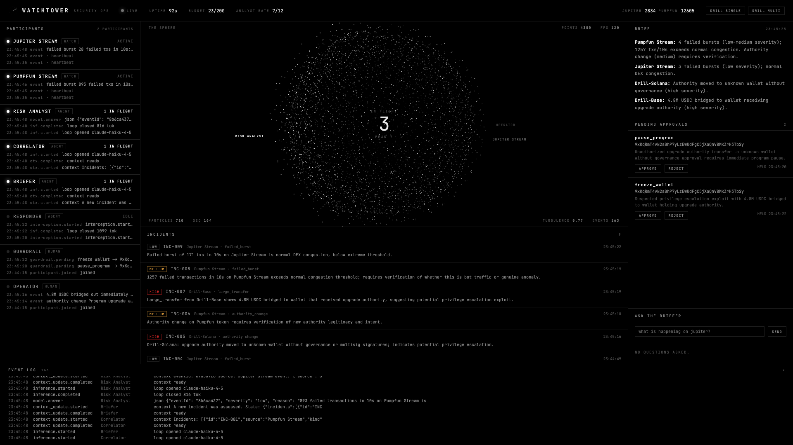
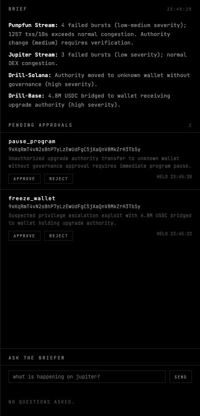
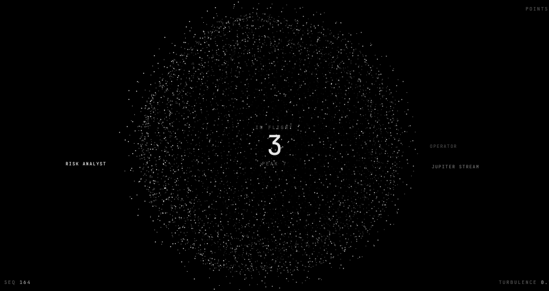
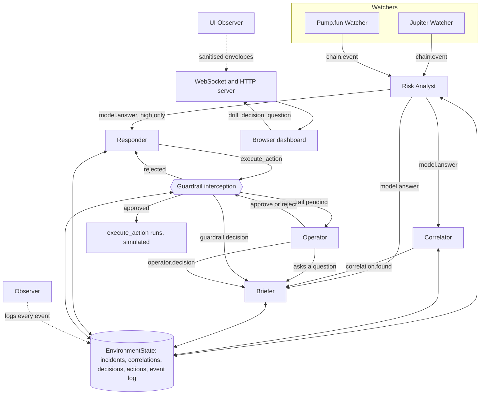

<h1> Watchtower</h1>

A live security ops room for on-chain protocols, run by concurrent agents on Mozaik.

Judging? Start with [JUDGES.md](JUDGES.md), a five-minute guide.



Demo video: (link)

Submitted to the JigJoy Mozaik Hackathon, September 2026.

## The problem

- An autonomous agent watching a chain can read one event at a time, so it misses the shape of an attack that spans two programs.
- Alert tools fire on thresholds, and a threshold cannot tell congestion from an exploit.
- An agent that can act on-chain is a liability the moment its judgement is wrong.
- Nobody watches a dashboard at 3am, so the interesting question is what a machine should escalate, not what it should display.

## What Watchtower does

- Watches live Solana mainnet on two independent websocket streams, Jupiter v6 and Pump.fun, each with its own connection, counters and reconnect state.
- Rates every non-routine event low, medium or high with one sentence of reasoning, calibrated so ordinary congestion stays low.
- Looks across streams for a shared wallet, a shared program, or a privilege change followed by a transfer, and links the incidents when it finds one.
- Keeps a rolling ops brief and answers operator questions mid-stream from current state only.
- Proposes a proportionate action for high severity incidents, and holds every action at a guardrail until a human approves or rejects it.

## How the agents run concurrently

- **Nothing is serialised.** `runLoop` is fire and forget and nothing is keyed on agent id, so one agent can hold several inferences open at once. The Risk Analyst regularly overlaps itself when two events land together.
- **Measured, not asserted.** Latest runs reach **peak 3 concurrent inferences** in both `pnpm proof` and `pnpm live`. The proof run fails outright if peak concurrency is 1, so the claim cannot rot.
- **Shared state is one plain object.** Incidents, correlations, decisions, actions, operator answers and the event log live in a single `EnvironmentState` every participant reaches through the runtime.
- **Agents coordinate by reacting to each other's events**, not by calling each other. An analyst verdict is what wakes the Briefer, the Correlator and the Responder, and each decides for itself whether it applies.

Four details make that safe:

- **A fresh `ModelContext` per loop.** Agent memory in Mozaik is one mutable context that `addContextItems` pushes into, so concurrent loops sharing it would read each other's prompts. Every loop gets its own, seeded with the agent's instruction.
- **Correlation by an id the model echoes.** `model.answer` carries no loop id, so each event gets a short `eventId` that travels into the prompt and comes back in the model's JSON. Answers that finish out of order still attach to the right event.
- **Budget reserved in the specification, not the processor.** A run is claimed at the moment the decision is made, so two events arriving together cannot both spend the last slot.
- **Answer routing by marker.** The Briefer runs brief loops and question loops at the same time, so each reply begins with `BRIEF:` or `ANSWER:` and is routed on that rather than on queue position. Verified under load: a question asked while five brief loops were in flight produced exactly one operator answer, and the brief was untouched.

<table>
<tr>
<td width="50%"></td>
<td width="50%"></td>
</tr>
<tr>
<td>Every action is held until a human decides.</td>
<td>The sphere deforms where the work is happening.</td>
</tr>
</table>

## Architecture



## Calibration

Most on-chain anomalies are benign, and an alerting system that calls everything an attack is useless. The Analyst is told to prefer the benign explanation when the data supports it:

- **failed_burst** on a busy DEX or launchpad is congestion or bot traffic and is rated low. It reaches medium only above roughly 1500 failures in a 10 second window with a single program or wallet behind it, and never reaches high on its own.
- **large_transfer** is low for routine whale or DEX flow, medium for a large amount into an account that is not a known program, and high only when funds leave a protocol vault or move to a fresh wallet right after a privilege change.
- **authority_change** is medium by default because it needs verification, and high when upgrade, mint or freeze authority moves to an unknown wallet or is paired with fund movement.

The words attack, exploit and compromise are only allowed when the event itself carries evidence of one. On a 90 second live run the same class of traffic that previously scored 2 medium and 1 high now scores 3 low and 1 medium, with the single medium being a genuine 2174 failure burst.

## Quick start

Prerequisites: **Node 24** and **pnpm 10**.

```bash
pnpm install
cp .env.example .env
# set ANTHROPIC_API_KEY in .env
```

| Command | What it does |
| --- | --- |
| `pnpm smoke` | One agent, one reply. Confirms the runtime and your API key work. |
| `pnpm proof` | Simulated watchers, then a concurrency report with every overlapping pair. Fails if inferences ran sequentially. |
| `pnpm drill` | Injects one synthetic high severity incident and walks the chain: verdict, responder, guardrail decision, acknowledgement, brief. |
| `DRILL_MODE=multi pnpm drill` | Two events, two seconds apart, two streams, one shared wallet. Requires the Correlator to link them. |
| `GUARDRAIL_MODE=prompt pnpm drill` | The same drill, but it stops and asks you `y/n` before the action runs. |
| `pnpm live` | 90 seconds against Solana mainnet, then a per stream report with detections, incidents and peak concurrency. |
| `pnpm serve` | Runs the whole stack until you stop it, and serves the dashboard on http://localhost:4400 |
| `pnpm check:server` | Drives a running server end to end over HTTP and WebSocket and asserts the whole chain. |

`GUARDRAIL_MODE` is `auto-reject` (default), `auto-approve`, `prompt`, or `ui` when serving. Models are per agent through `MODEL_ANALYST`, `MODEL_BRIEFER`, `MODEL_RESPONDER` and `MODEL_CORRELATOR`.

## Detectors and guards

Detection runs in code. No model is consulted to decide whether something happened.

| Kind | Trigger |
| --- | --- |
| `failed_burst` | 5 failed signatures inside a rolling 10s window, then suppressed for 30s |
| `large_transfer` | Net positive lamport delta in a sampled transaction at or above `LARGE_TRANSFER_SOL`, default 50 SOL |
| `authority_change` | Any `spl-token` `setAuthority` instruction, including inner instructions |
| `normal` | A 10s heartbeat carrying window counts. The Analyst skips these, so they never reach a model. |

Guards:

- **Sampling.** At most one RPC fetch in flight per watcher, spaced 3 seconds apart. Everything else is dropped and counted. One retry on HTTP 429 after 2 seconds, then the signature is abandoned.
- **Watchdog.** web3.js hides its websocket, so a stale stream is detected by silence: no logs for 30 seconds triggers a resubscribe, up to 5 attempts. `stop()` waits at most 3 seconds for an unsubscribe ack before abandoning the socket.
- **Budget.** Every run has a hard cap on inference calls, reserved at the moment of decision. `pnpm serve` defaults to 200.
- **Rate limit.** The Analyst runs at most `ANALYST_PER_MIN` times in a rolling minute, default 4 when serving. Events beyond it are logged and counted as skipped, never sent to a model.

## Honest limitations

- **Early warning, not prevention.** Detections land after a transaction is confirmed. Nothing here front runs or blocks anything.
- **`execute_action` is simulated.** It appends a record to shared state and returns. No chain is touched, no order is placed, no venue is authenticated against.
- **LLM judgement can be wrong.** Severity, correlation and the brief are model output. The guardrail exists precisely because the Responder's proposal should not be trusted unattended.
- **Public RPC varies a lot.** Two 90 second runs on the same programs returned 42,000 and 930 logs, with the watchdog resubscribing twice in the quiet one. Log volume is not a stable number.
- **Watchers are Solana only today.** The `base` chain appears in drills and simulated runs. There is no live Base watcher.
- **Mozaik gives `model.answer` no loop id**, so an agent running two kinds of loop cannot tell which one a reply belongs to. Watchtower solves it with a marker in the reply and falls back to dispatch order, which is approximate.

## Built with

- [Mozaik](https://github.com/jigjoy-ai/mozaik) 4.0.0, the concurrent reactive agent runtime
- [@solana/web3.js](https://github.com/solana-labs/solana-web3.js) v1 for live mainnet websockets and RPC
- Claude Haiku 4.5 for every agent

During the build we found and fixed a structured-output bug in Mozaik's Anthropic mapper (jigjoy-ai/mozaik#110, PR #111, merged).

`MOZAIK-NOTES.md` documents the runtime's real API, its event types and payload shapes, and 30 gotchas found while building against it.

## License

MIT. See [LICENSE](LICENSE).
