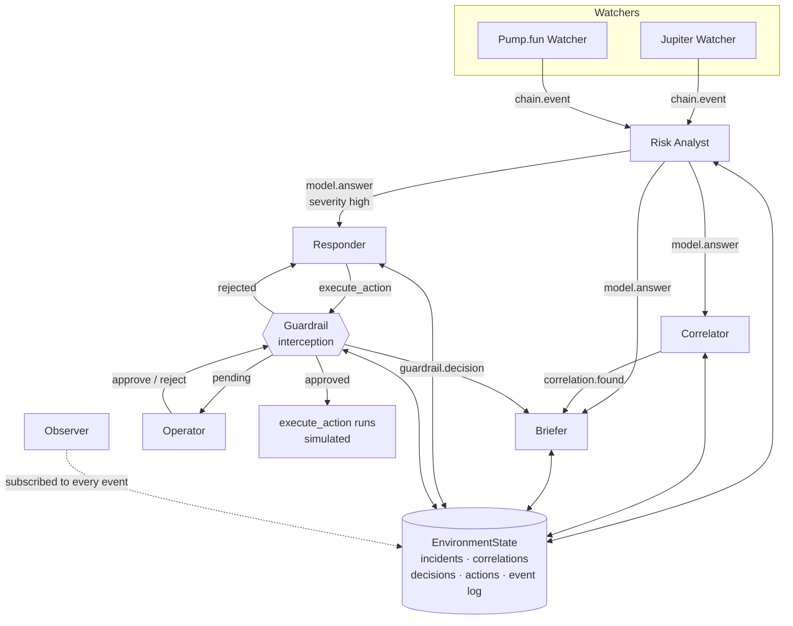

# Watchtower

A live security ops room for on-chain protocols, run by concurrent agents on Mozaik.

## What it does

- **Watches live Solana mainnet.** Two independent websocket streams (Jupiter v6 and Pump.fun), each with its own connection, counters and reconnect state.
- **Analyst** rates every non-routine on-chain event `low` / `medium` / `high` with one sentence of reasoning.
- **Correlator** looks across streams and decides whether separate incidents are one coordinated event — same wallet, same kind seconds apart, or a plausible sequence.
- **Briefer** keeps a rolling ops brief, reacting to new verdicts, cross-stream links, and operator decisions.
- **Responder** proposes a proportionate action (`pause_program`, `freeze_wallet`, `alert_operator`) for high-severity incidents — and every call is held by a **Guardrail** for human approval before anything runs.

## How the agents run concurrently

- **Nothing is serialised.** `runLoop` is fire-and-forget and nothing is keyed on agent id, so one agent can have several inferences open at once — the Analyst regularly overlaps itself when two events land together.
- **Measured, not asserted.** Latest runs: **peak 3 concurrent inferences** in `pnpm live` (22,000 logs across both streams) and **peak 3** in `pnpm proof`. The proof run fails outright if peak concurrency is 1.
- **A fresh `ModelContext` per loop.** Agent memory in Mozaik is one mutable context that `addContextItems` pushes into; concurrent loops sharing it would read each other's prompts. Every loop gets its own context seeded with the agent's instruction.
- **Correlation by id, never by arrival order.** `model.answer` carries no loop id, so each event gets a short `eventId` that travels into the prompt and comes back in the model's JSON. Out-of-order answers still attach to the right event.
- **The budget is reserved in the specification, not the processor.** A run is claimed at the moment the decision is made, so two events arriving together can't both spend the last slot. Every script has a hard cap.
- **Every handler is hardened.** Mozaik dispatches handlers with no error boundary — one throw kills the process mid-publish. All specifications and processors extend `SafeSpecification` / `SafeProcessor`, which log and continue, and every custom event payload passes a type guard before a field is read.
- **Shared state is one plain object.** Incidents, correlations, decisions, actions and the event log live in a single `EnvironmentState` that every participant reaches through the runtime.

## Architecture



## Quick start

Prerequisites: **Node 24**, **pnpm 10**.

```bash
pnpm install
cp .env.example .env
# set ANTHROPIC_API_KEY in .env
```

| Command | What it prints |
| --- | --- |
| `pnpm smoke` | One agent, one reply. Confirms the runtime and your API key work. |
| `pnpm proof` | Simulated watchers, then a concurrency report: peak concurrent inferences and every overlapping pair with timestamps. Fails if inferences ran sequentially. |
| `pnpm drill` | Injects one synthetic high-severity incident and walks the whole chain: verdict → responder → guardrail decision → acknowledgement → brief. |
| `DRILL_MODE=multi pnpm drill` | Two events, two seconds apart, two streams, one shared wallet. Requires the Correlator to link them and the brief to say so. |
| `GUARDRAIL_MODE=prompt pnpm drill` | Same drill, but it stops and asks you `y/n` before the action runs. |
| `pnpm live` | 90 seconds against Solana mainnet, then a per-stream report: logs, detections, correlations, incidents, guardrail decisions and peak concurrency. |

`GUARDRAIL_MODE` is `auto-reject` (default), `auto-approve`, or `prompt`. Models are per-agent via `MODEL_ANALYST`, `MODEL_BRIEFER`, `MODEL_RESPONDER`, `MODEL_CORRELATOR`.

## Detectors

All four run in code. No model is consulted to decide whether something happened.

| Kind | Trigger |
| --- | --- |
| `failed_burst` | 5 failed signatures inside a rolling 10s window, then suppressed for 30s |
| `large_transfer` | Net positive lamport delta across a sampled transaction ≥ `LARGE_TRANSFER_SOL` (default 50 SOL) |
| `authority_change` | Any `spl-token` `setAuthority*` instruction, including inner instructions |
| `normal` | A 10s heartbeat carrying window counts; the Analyst skips these, so they never reach a model |

Rate guards, per watcher:

- At most **one RPC fetch in flight**, spaced **3s** apart. Everything else is dropped and counted.
- One retry on HTTP 429 after 2s, then the signature is abandoned.
- A staleness watchdog resubscribes after **30s** of silence, up to 5 attempts, 3s apart.
- `stop()` waits at most 3s for an unsubscribe ack before abandoning the socket.

## Honest limitations

- **Early warning, not prevention.** Detections land after a transaction is confirmed. Nothing here front-runs or blocks anything.
- **`execute_action` is simulated.** It appends a record to shared state and returns. No chain is touched, no order is placed, no venue is authenticated against.
- **LLM judgement can be wrong.** Severity, correlation and the brief are model output. The Guardrail exists precisely because the Responder's proposal should not be trusted unattended.
- **Public RPC varies a lot.** Two 90s runs on the same programs returned 42,000 and 930 logs, with the watchdog resubscribing twice in the quiet one. Log volume is not a stable number.
- **Watchers are Solana-only today.** The `base` chain appears in drills and simulated runs; there is no live Base watcher.

## Built with

- [Mozaik](https://github.com/jigjoy-ai/mozaik) 4.0.0 — the concurrent reactive agent runtime
- [@solana/web3.js](https://github.com/solana-labs/solana-web3.js) v1 — live mainnet websockets and RPC
- Claude Haiku 4.5 for every agent

Building this surfaced an Anthropic structured-output bug in Mozaik ([issue #110](https://github.com/jigjoy-ai/mozaik/issues/110), fixed by merged [PR #111](https://github.com/jigjoy-ai/mozaik/pull/111)); the fix is not in 4.0.0, so Watchtower prompts for JSON and parses it tolerantly instead.

`MOZAIK-NOTES.md` documents the runtime's real API, its event types and payload shapes, and 30 gotchas found while building against it.

## Status

Hackathon build for the JigJoy Mozaik hackathon, September 2026.
